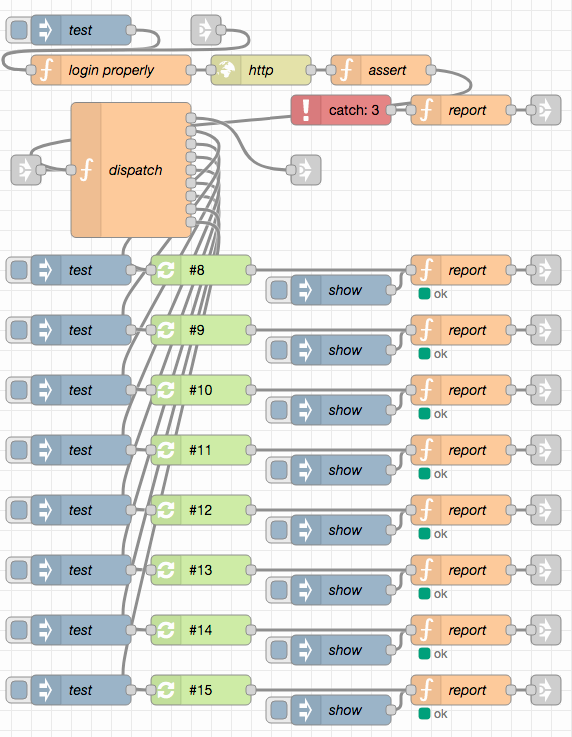
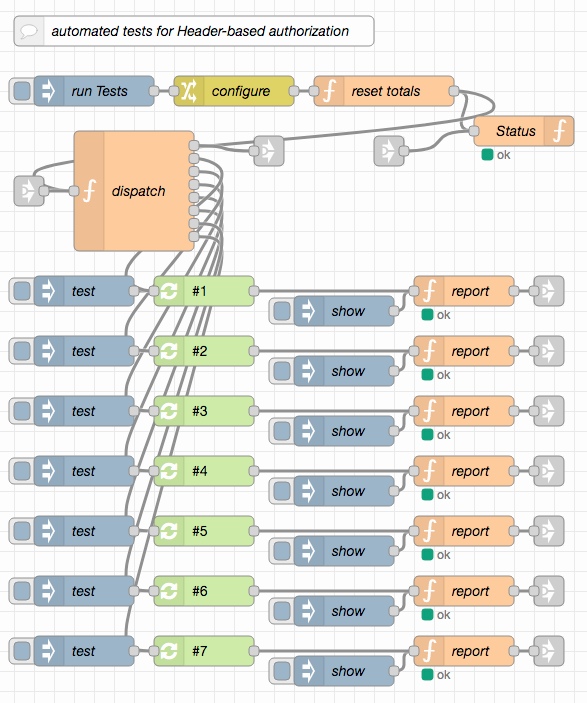
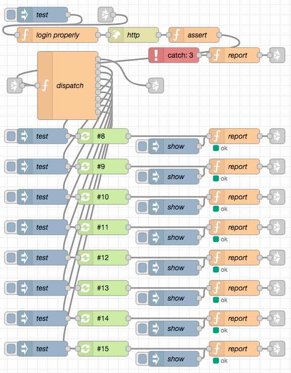
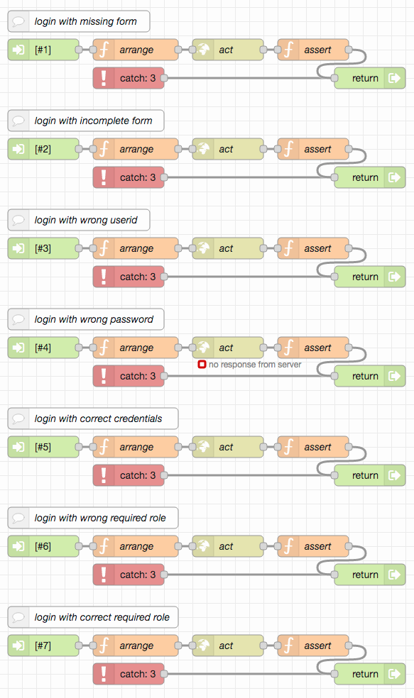
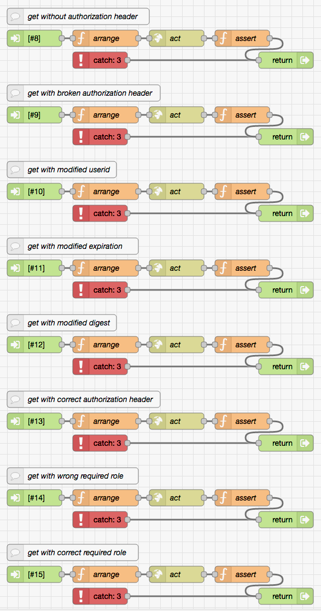

# node-red-authorization-examples #

This repository contains three examples of user authentication and authorization for Node-RED flows. While they were designed to be immediately usable with the server implemented in [node-red-within-express](https://github.com/rozek/node-red-within-express) and play well together with the user management described in [node-red-user-management-example](https://github.com/rozek/node-red-user-management-example), all examples may also be used in other environments.

> Just a small note: if you like this module and plan to use it, consider "starring" this repository (you will find the "Star" button on the top right of this page), so that I know which of my repositories to take most care of.

## Prerequisites ##

Every example requires the following Node-RED extension

* [node-red-contrib-reusable-flows](https://github.com/ollixx/node-red-contrib-reusable-flows) "Reusable Flows" allow multiply needed flows to be defined once and then invoked from multiple places

Additionally, all examples expect the global flow context to contain an object called `UserRegistry` which has the same format as described in "node-red-within-express":

* the object's property names are the ids of registered users user ids have no specific format, they may be user names, email addresses or any other data you are free to choose - with **two important exceptions**: user ids must neither contain any slashes ("/") nor any colons (":") or the authentication mechanisms described below (and the user management described in [node-red-user-management-example](https://github.com/rozek/node-red-user-management-example)) will fail. Additionally, upper and lower case in user ids is not distinguished
* the object's property values are JavaScript objects with the following properties, at least (additional properties may be added at will):
  * **Roles** is either missing or contains a list of strings with the user's roles. There is no specific format for role names
  * **Salt** contains a random "salt" value which is used during PBKDF2 password hash calculation
  * **Hash** contains the actual PBKDF2 hash of the user's password

When used outside "node-red-within-express", the following flows allow such a registry to be loaded from an external JSON file called `registeredUsers.json` (or to be created if no such file exists or an existing file can not be loaded) and written back after changes:

Just import [these flows](outside-node-red-within-express.json), place them on your Node-RED workspace and - if need be - check the "Inject once" setting of the node labelled "at Startup". By default, the created user registry contains a single user `node-red` with the password `t0pS3cr3t!` and a single role `node-red` (this is exactly the same user who is also included in "node-red-within-express" by default)

For testing and debugging purposes, the [following flow](show-user-registry.json) may also be imported, which dumps the current contents of the user registry onto Node-RED's debug console when clicked:

### Postman Collection ###

Some of the experiments described below can be executed more easily if you have [Postman](https://www.postman.com/) installed on your machine. You may then import the [Postman collection](PostmanCollection.json) that comes with this repository and use predefined requests for testing.

## Basic HTTP Authorization ##

The simplest approach to user authentication and authorization is to utilize the "basic HTTP authentication" built into every browser: if a requested resource requires a client to authenticate, the browser itself opens a small dialog window where users may enter their name and password (or cancel the request). These credentials are then sent back to the server for validation - if the server still denies access, the dialog is presented again, allowing users to enter different credentials - otherwise the browser stores the successful entries internally and, from now on, automatically sends them along with every request.

> Nota bene: user credentials (especially passwords) are sent in plain text form - for that reason, it is important to use secured connections (i.e., HTTPS) only

The upper output is used for successful authentications, the lower one for failures.

If you require the authenticating user to have a specific role, you may set `msg.requiredRole` to that role before invoking the `basic auth` flow - otherwise, user roles will not be checked.

Upon successful authentication, `msg.authenticatedUser` contains the id of the authenticated user and `msg.authorizedRoles` contains a (possibly empty) list with the roles of that user.

### Try yourself ###

The following example illustrates how to integrate basic authentication into Node-RED flows. Just [import it](try-basic-auth.json) and navigate your browser to the shown entry point.

The "basic HTTP authentication" procedure frees developers from having to design and implement their own login forms as the user interface is already built into the browser.

However, basic authentication lacks (implicit) expiration and explicit logout, making it very difficult to terminate an authenticated "session" or to change users: once correct credentials have been given, the browser always automatically attaches them to every request - unless a "private" window (or tab) is opened: in that case, the browser withdraws any given credentials as soon as the window (or tab) is closed.

### Automated Tests ###

There are a few automated (client-side) tests (built with the author's [node-red-test-support](https://github.com/rozek/node-red-test-support)) for this implementation. These tests require

* the [Chai Assertion Library](https://www.chaijs.com/) - `npm install chai`

to be installed.

To run them, just import [the test flows](test-basic-auth.json) into your workspace and enter the server to be tested in the node called "configure".

## Cookie-based Authorization ##

Another popular approach is to let users log-in and generate access tokens which are then used as "cookies" for the communication between browser and server. Such cookies are also automatically attached to every request, but the contained tokens may be designed to "expire" or to be deleted upon a "logout".

The token in this example consists of a user id and an expiration time. While it is stored in plain text (and, thus, may be inspected by the client), its value is secured with a "message digest" - as a consequence, any attempt to change the token will inevitably be recognized and lead to authorization loss. On the other hand, any successful token validation automatically refreshes that token - tokens therefore effectively expire after a certain time of *inactivity* only.

The key used to generate message digests is randomly chosen at server startup - a server restart will therefore automatically invalidate any active tokens.

Token lifetime may be configured - by default, it is set to 2 minutes.

In order to "login", POST a form containing the variables `UserId` and `Password` to the proper endpoint (`/cookie-auth` in this example).

> Nota bene: current law often requires users to be informed about cookie usage. The cookie used here counts as a "technically required cookie" which cannot be forbidden if the visited site is expected to work as foreseen.

The upper outputs are used for successful authentications and logins, the lower ones for failures.

If you require the authenticating user to have a specific role, you may set `msg.requiredRole` to that role before invoking `cookie auth` or `cookie login` - otherwise, user roles will not be checked.

Upon successful authentication, `msg.authenticatedUser` contains the id of the authenticated user and `msg.authorizedRoles` contains a (possibly empty) list with the roles of that user.

### Try yourself ###

The following example illustrates how to integrate Cookie-based authentication into Node-RED flows. Just [import it](try-cookie-auth.json) and:

* send a POST request to the shown entry point in order to log-in and then
* send a GET request to the same entry point to validate that log-in and access the protected resource

(The included [Postman collection](PostmanCollection.json) facilitates these steps.)

Sending GET requests without prior login (or after token expiration) should fail with status code 401 (Unauthorized)

The login request should either contain

* a body of type "application/json" with the JSON serialization of an object containing the properties `UserId` and `Password`, at least, or
* a body of type "application/x-www-form-urlencoded" with the form variables `UserId` and `Password`, at least

Additional object properties or form variables will be ignored by the authentication itself, but passed on to any following nodes.

Successful login, token validation and token refresh always add the related cookie to the `cookies` property of the `msg` object which, thus, automatically becomes part of the flow's response.

Any login or token validation failure automatically deletes the token cookie, comparable to a logout.

### Automated Tests ###

There are a few automated (client-side) tests (built with the author's [node-red-test-support](https://github.com/rozek/node-red-test-support)) for this implementation. These tests require

* the [Chai Assertion Library](https://www.chaijs.com/) - `npm install chai`

to be installed.

To run them, just import [the test flows](test-cookie-auth.json) into your workspace and enter the server to be tested in the node called "configure".

## Header-based Authorization ##

The third example also generates access tokens but stores them in an HTTP header instead of a cookie. This avoids having to follow any cookie-related laws but requires some JavaScript on the client side which always adds a proper authorization header to any outgoing request.

Again, access tokens consist of a user id and an expiration time. While they are stored in plain text (and, thus, may be inspected by the client), their value is secured with a "message digest" - as a consequence, any attempt to change a token will inevitably be recognized and lead to authorization loss. On the other hand, any successful token validation automatically refreshes that token - tokens therefore effectively expire after a certain time of inactivity only.

The key used to generate message digests is randomly chosen at server startup - a server restart will therefore automatically invalidate any active sessions.

Token lifetime may be configured, by default, it is set to 2 minutes.

In order to "login", POST a form containing the variables `UserId` and `Password` to the proper endpoint (`/header-auth` in this example).

The upper outputs are used for successful authentications and logins, the lower ones for failures.

If you require the authenticating user to have a specific role, you may set `msg.requiredRole` to that role before invoking `header auth` or `header login` - otherwise, user roles will not be checked.

Upon successful authentication, `msg.authenticatedUser` contains the id of the authenticated user and `msg.authorizedRoles` contains a (possibly empty) list with the roles of that user.

### Try yourself ###

The following example illustrates how to integrate Header-based authentication into Node-RED flows. Just [import it](try-header-auth.json) and:

* send a POST request to the shown entry point in order to log-in and then
* send a GET request to the same entry point to validate that log-in

(The included [Postman collection](PostmanCollection.json) facilitates these steps as it also automatically copies the authorization header of any successful authentication into the GET request.)

Sending GET requests without prior login (or after token expiration) should fail with status code 401 (Unauthorized)

The login request should either contain

* a body of type "application/json" with the JSON serialization of an object containing the properties `UserId` and `Password`, at least, or
* a body of type "application/x-www-form-urlencoded" with the form variables `UserId` and `Password`, at least

Additional object properties or form variables will be ignored by the authentication itself, but passed on to any following nodes.

Successful login, token validation and token refresh always add the required header to the `headers` property of the `msg` object which, thus, automatically becomes part of the response to the incoming request.

Any login or token validation failure automatically deletes the authorization header, comparable to a logout.

### Automated Tests ###

There are a few automated (client-side) tests (built with the author's [node-red-test-support](https://github.com/rozek/node-red-test-support)) for this implementation. These tests require

* the [Chai Assertion Library](https://www.chaijs.com/) - `npm install chai`

to be installed.

To run them, just import [the test flows](test-header-auth.json) into your workspace and enter the server to be tested in the node called "configure".

## License ##

[MIT License](LICENSE.md)
