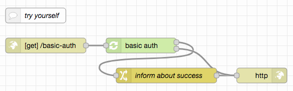

# node-red-authorization-examples #

This repository contains three examples of user authentication and authorization for Node-RED flows. While they were designed to be immediately usable with the server implemented in [node-red-within-express](https://github.com/rozek/node-red-within-express), all examples may also used in other environments.

## Prerequisites ##

Every example requires the following Node-RED extension

* [node-red-contrib-components](https://github.com/ollixx/node-red-contrib-components) "Components" allow multiply needed flows to be defined once and then invoked from multiple places

Additionally, all examples expect the global flow context to contain an object called `UserRegistry` which has the same format as described in  [node-red-within-express](https://github.com/rozek/node-red-within-express):

* the object's property names are the ids of registered users user ids have no specific format, they may be user names, email addresses or any other data you are free to choose
* the object's property values are JavaScript objects with the following properties, at least (additional properties may be added at will):
  * **Roles** is either missing or contains a list of strings with the user's roles. There is no specific format for role names - just the role `node-red` has a special meaning: users with this role are allowed to access the embedded Node-RED editor
  * **Salt** contains a random "salt" value which is used during PBKDF2 password hash calculation
  * **Hash** contains the actual PBKDF2 hash of the user's password

## Basic HTTP Authentication ##

### Try yourself ###

## Cookie-based Authorization ##

### Try yourself ###

## Header-based Authorization ##

### Try yourself ###

## License ##

[MIT License](LICENSE.md)
