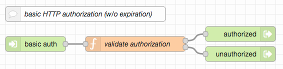

# node-red-authorization-examples #

This repository contains three examples of user authentication and authorization for Node-RED flows. While they were designed to be immediately usable with the server implemented in [node-red-within-express](https://github.com/rozek/node-red-within-express), all examples may also used in other environments.

## Prerequisites ##

Every example requires the following Node-RED extension

* [node-red-contrib-components](https://github.com/ollixx/node-red-contrib-components) "Components" allow multiply needed flows to be defined once and then invoked from multiple places

Additionally, all examples expect the global flow context to contain an object called `UserRegistry` which has the same format as described in  "node-red-within-express":

* the object's property names are the ids of registered users user ids have no specific format, they may be user names, email addresses or any other data you are free to choose
* the object's property values are JavaScript objects with the following properties, at least (additional properties may be added at will):
  * **Roles** is either missing or contains a list of strings with the user's roles. There is no specific format for role names
  * **Salt** contains a random "salt" value which is used during PBKDF2 password hash calculation
  * **Hash** contains the actual PBKDF2 hash of the user's password

When used outside "node-red-within-express", the following flows allow such a registry to be loaded from an external JSON file called `registeredUsers.json` (or to be created if no such file exists or an existing file can not be loaded) and written back after changes:

Just import [these flows](outside-node-red-within-express.json), place them on your Node-RED workspace and - if need be - check the "Inject once" setting of the node labelled "at Startup".

For testing and debugging purposes, the [following flow](show-user-registry.json) may also be imported, which dumps the current contents of the user registry onto Node-RED's debug console when clicked:

## Basic HTTP Authentication ##

The simplest approach to user authentication is to utilize the "basic HTTP authentication" built into every browser: if a requested resource requires a client to authenticate, the browser itself opens a small dialog window where users may enter their name and password (or cancel the request). These credentials are then sent back to the server for validation - if the server still denies access, the dialog is presented again, allowing users to enter different credentials - otherwise the browser stores the successful entries internally and, from now on, automatically sends them along with every request.

> Nota bene: user credentials (especially passwords) are sent in plain text form - for that reason, it is important to use secured connections (i.e., HTTPS) only

If desired, "Component use" nodes for "basic Auth" may be configured to require the authenticating user to have a specific role - otherwise, user roles are ignored. The upper output is used for successful authentications, the lower one for failures.

### Try yourself ###

The following example illustrates how to integrate basic authentication into Node-RED flows. Just [import it](try-basic-auth.json) and navigate your browser to the shown entry point.

The "basic HTTP authentication" procedure frees developers from having to design and implement their own login forms as the user interface is already built into the browser.

However, basic authentication lacks (implicit) expiration and explicit logout, making it very difficult to terminate an authenticated "session" or to change users: once correct credentials have been given, the browser always automatically attaches them to every request - unless a "private" window (or tab) is opened: in that case, the browser withdraws any given credentials as soon as the window (or tab) is closed.

## Cookie-based Authorization ##

Another popular approach is to let users log-in and to generate access tokens which are then set as communication "cookies". Such cookies are also automatically attached to every request, but the contained tokens may be designed to "expire" or to be deleted upon a "logout".

The token in this example consists of a user id and an expiration time. While it is stored in plain text (and, thus, may be inspected by the client), its value is secured with a "message digest" - as a consequence, any attempt to change the token will inevitably be recognized and lead to authorization loss. On the other hand, any successful token validation automatically refreshes that token - tokens therefore effectively expire after a certain time of *inactivity* only.

The key used to generate message digests is randomly chosen at server startup - a server restart will therefore automatically invalidate any active sessions.

Token lifetime may be configured, by default, it is set to 10 minutes.

> Nota bene: current law often requires users to be informed about cookie usage. The cookie used here counts as a "technically required cookie" which cannot be forbidden if the visited site is expected to work as foreseen.

If desired, "Component use" nodes for "Cookie Login" may be configured to require the authenticating user to have a specific role - otherwise, user roles are ignored. The upper output is used for successful authentications, the lower one for failures. Similarly, the upper output of "Component use" nodes for "Cookie Auth" fires upon successful token validation, the lower one in case of a validation failure.

### Try yourself ###

The following example illustrates how to integrate Cookie-based authentication into Node-RED flows. Just [import it](try-cookie-auth.json) and:

* send a POST request to the shown entry point...

## Header-based Authorization ##

### Try yourself ###

## License ##

[MIT License](LICENSE.md)
